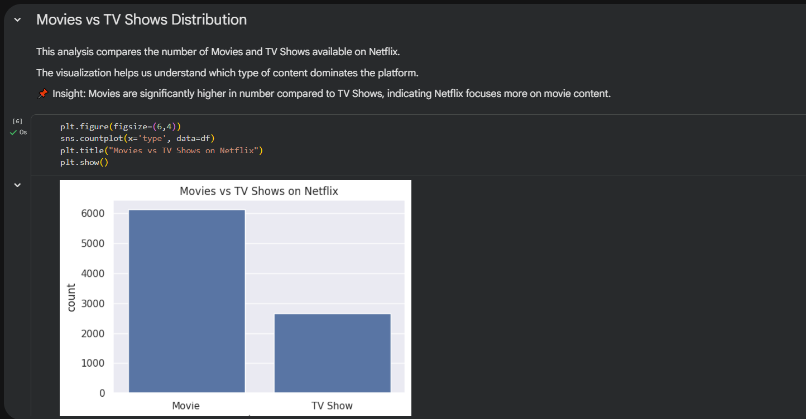
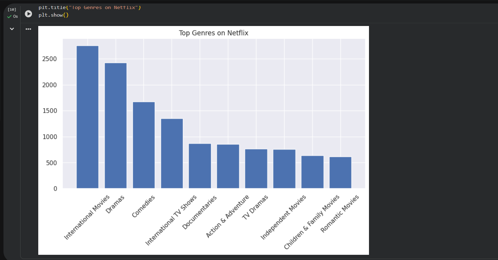
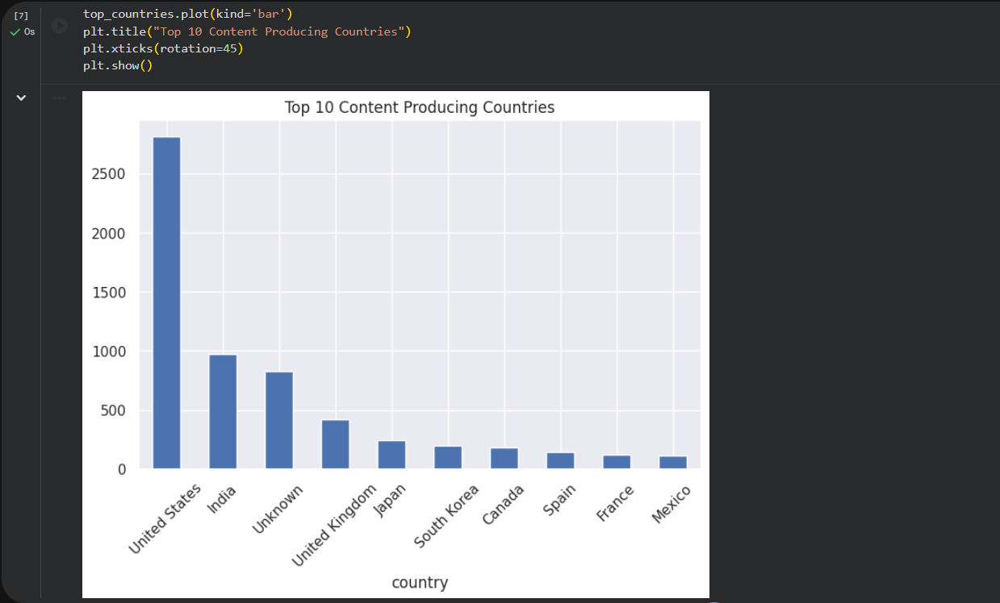

# Netflix Data Analysis & ML Project 📊🤖

🚀 Beginner-friendly Data Analysis + Machine Learning Project

---

## 📌 Overview

This project analyzes the Netflix dataset to uncover insights about content trends, genres, and global distribution.
Additionally, a simple Machine Learning model is built to predict whether a content item is a Movie or TV Show.

---

## 🛠️ Technologies Used

* Python
* Pandas, NumPy
* Matplotlib, Seaborn
* Scikit-learn
* Jupyter Notebook

---

## 📊 Key Insights

* Movies dominate Netflix content compared to TV Shows
* Content production increased significantly after 2015
* United States is the leading content producer
* Drama and International genres are the most popular

---

## 🤖 Machine Learning Model

* Built a Decision Tree Classifier
* Predicts whether content is Movie or TV Show
* Trained on features like release year

---

## 📊 Model Performance

* Decision Tree Classifier achieved ~73% accuracy on test data

---

## 📈 Visualizations

### Movies vs TV Shows

### Top Genres

### Top Countries

---

## ▶️ How to Run

1. Clone the repository
2. Open `netflix_analysis.ipynb` in Jupyter Notebook or Google Colab
3. Run all cells step by step

### Requirements:

* Python
* Pandas, NumPy
* Matplotlib, Seaborn
* Scikit-learn

---

## 📁 Project Structure

netflix-data-analysis/
│
├── netflix_analysis.ipynb
├── images/
├── README.md

---

## 🙋‍♂️ Author

Sanidhya Shrivastava

---
